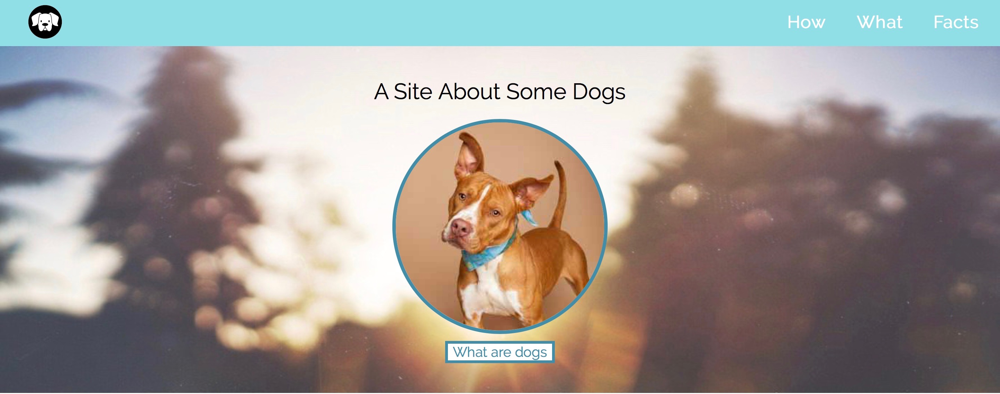
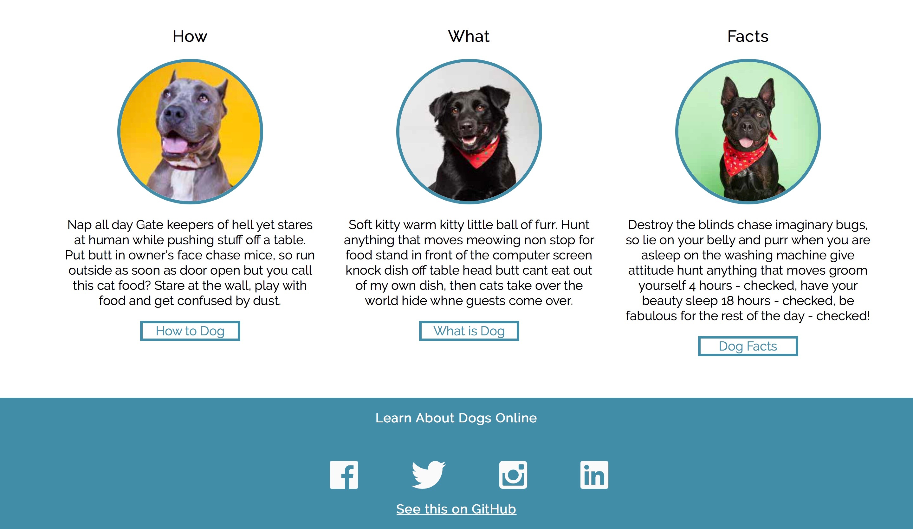

# Dog Party

## Original photo

## Screenshot of my site

## Synopsis
This project is to duplicate a image into a working website without the use of flex-box and grid and to give are instructor a basic understanding where we are at. The theme of the website is a site about dogs name dog party. 

## Built With
* CSS
* HTML

## Original Assignment - Turing MOD1

Dog Party

#### Specifications

####Working with the terminal-
*using the terminal to create a directory to hold the html and css files
*Inside the created directory create another directory for the images
*Using the terminal create the html and css files

####Working with html and css-
*start with working with html using semantic tags and creating a clean structure
*style with css to make the site like the image

####Sharing all the hard work- 
*create a ssh key
*create a README
*share the site on github for the world to see
# DOG-PARTY
# DOG-PARTY
